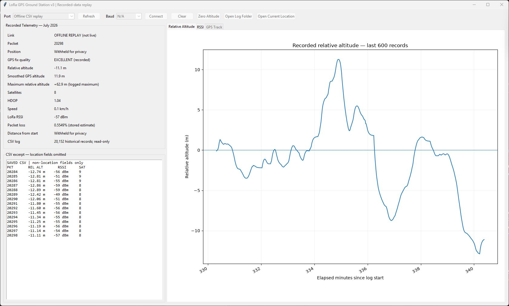

# LoRa GPS Telemetry & Ground Station

An Arduino Nano reads a NEO-6M GPS and transmits telemetry over a 915 MHz RFM95
radio link. An Arduino Uno receiver forwards packets and RSSI to a Python
desktop dashboard.

The dashboard shows GPS-fix quality, last-known position during fix loss,
median/EMA-smoothed relative altitude, signal strength, sequence-gap loss,
ground track, and CSV logging. It is an observation/logging prototype, not a
flight-qualified navigation or flight-control system.

## Dashboard



Static replay view of saved July 2026 bench telemetry, captured in September
2026 using the v3 dashboard. Location data is withheld; the plot shows the last
600 records against elapsed time. This is not a live connection or a new hardware
test. GPS altitude variation is not a demonstrated rocket trajectory.

## Measured result

A retained private July 2026 log contains **20,152 packets over 340.4 minutes**,
with **0.5549% final reported packet loss**, **-53.1 dBm mean RSSI**, up to
**11 satellites**, and **379 rows retaining the last-known position**.
These are results from one recorded session, not range, accuracy, or flight
qualification claims. [Evidence and method](docs/validation.md) distinguish
the stored dashboard loss estimate from independently measured RF delivery.
Raw logs and their real coordinates are deliberately excluded.

## Try it without hardware

Use Python 3.10+ with Tk support. From this repository root:

```sh
python -m venv .venv
# Activate the environment using your shell's normal command.
python -m pip install -r requirements.txt
python -m unittest discover -s tests -v
python -m ground_station.offline_replay
```

The replay uses explicitly fictional coordinates near (0, 0), needs no serial
device or graphical display, and reports six received packets and one sequence
gap. It exercises the actual dashboard parsing, smoothing, and state methods;
it does not recreate the historical hardware experiment.

To launch the GUI after configuring hardware:

```sh
python ground_station/ground_station_v3.py
```

Choose the Uno's serial port and 9600 baud, then Connect. This opens a real
serial device and automatically starts a local log. See
[hardware/setup](docs/hardware-and-setup.md) before powering or flashing boards.

## What's included

- `firmware/NanoGPStransmitter/`: original GPS/radio transmitter sketch.
- `firmware/UnoReceiverDashboard/`: recommended single-line serial receiver.
- `firmware/UNOreceiverV2GPS/`: original two-line serial receiver alternative.
- `ground_station/ground_station_v3.py`: unchanged historical desktop app.
- `ground_station/offline_replay.py`, `tests/`: publication-preparation replay
  adapter and regression tests, added later; not historical hardware evidence.
- `examples/synthetic_packets.txt`: invented serial data, never field data.

The original source files are preserved byte-for-byte. This focused copy does
not include the separate flight-computer core, `FC1` protocol, camera recorder,
private field logs, downloaded archives, or hardware CAD.

## Boundaries and privacy

The legacy parser is permissive, not a hardened input validator. Loss tracking
assumes an ordered increasing sequence; it is not duplicate-, restart-, or
wrap-safe. GPS altitude is noisy and smoothing adds delay. See
[protocol and limitations](docs/protocol.md).

Live CSV logs include exact raw/displayed coordinates and timestamps. They are
ignored by Git; do not upload them, screenshots, or a `.git` history containing
them. The **Open Current Location** button sends the current/last-known
coordinates to Google Maps in your browser only when clicked. No map is opened
by the offline tests or replay.

## Provenance and license status

No project-wide license has been selected. [Provenance](docs/provenance.md)
records the original source hashes and later preparation work. Separately
installed dependencies and their upstream authors are documented in
[third-party notices](THIRD_PARTY_NOTICES.md). No dependency source or compiled
firmware is distributed here.
